# 📧 Mailed - AI-Powered Email Tracking & Analytics

<div align="center">
  
  <h3>Intelligent Email Tracking with Real-Time Analytics</h3>
  <p>Track email opens, analyze recipient behavior, and gain insights with AI-powered categorization</p>

  [](https://mailed.netlify.app)
  [](https://mailed.netlify.app/mailed-extension.zip)
</div>

---

## 🚀 **What is Mailed?**

Mailed is a **full-stack email tracking application** that automatically injects invisible tracking pixels into your Gmail messages, providing real-time analytics on email opens, recipient devices, locations, and AI-powered email categorization.

### ✨ **Key Features**

- **🎯 Real-Time Tracking**: 1x1 pixel injection with instant open notifications
- **🤖 AI Categorization**: Hugging Face-powered email classification
- **📊 Advanced Analytics**: Device types, locations, open timestamps
- **🔌 Gmail Extension**: Seamless Chrome extension integration
- **📱 Responsive Design**: Beautiful UI with Tailwind CSS
- **🔐 OAuth Security**: Google OAuth 2.0 authentication
- **⚡ Live Updates**: Real-time dashboard with 30-second refresh intervals

---

## 🏗️ **Tech Stack**

### **Frontend**
- ⚛️ **React 18** + TypeScript
- 🎨 **Tailwind CSS** for styling
- 📱 **Responsive Design** with modern UI/UX
- 🔄 **Real-time Updates** with automatic polling

### **Backend**
- 🚀 **Node.js** + Express.js
- 🗄️ **Supabase** (PostgreSQL) database
- 🤖 **Hugging Face API** for AI categorization
- 📧 **Gmail API** integration
- 🔐 **Google OAuth 2.0** authentication

### **Chrome Extension**
- 🔌 **Manifest V3** compliance
- 📧 **Gmail DOM Manipulation** for pixel injection
- 🎯 **Automatic Email Detection** with fallback prompts
- 💾 **Local Storage** for user preferences

### **Deployment**
- 🌐 **Frontend**: Netlify
- ⚡ **Backend**: Render
- 🗄️ **Database**: Supabase Cloud
- 🔧 **CI/CD**: GitHub Actions ready

---

## 📸 **Screenshots**

<div align="center">
  
  
</div>

---

## 🚀 **Quick Start**

### **1. Clone & Install**
```bash
git clone https://github.com/divyanshkhurana06/mailed0.git
cd mailed0
npm install
cd server && npm install
```

### **2. Environment Setup**
Create `.env` in both root and `server/` directories:

**Frontend (.env)**
```env
VITE_API_URL=http://localhost:3000/api
```

**Backend (server/.env)**
```env
GOOGLE_CLIENT_ID=your_google_client_id
GOOGLE_CLIENT_SECRET=your_google_client_secret
GOOGLE_REDIRECT_URI=http://localhost:3000/api/auth/google/callback
SUPABASE_URL=your_supabase_url
SUPABASE_SERVICE_KEY=your_supabase_service_key
HUGGINGFACE_API_KEY=your_huggingface_api_key
FRONTEND_URL=http://localhost:5173
```

### **3. Database Setup**
Run the SQL migration in your Supabase dashboard:
```sql
-- Users table
CREATE TABLE users (
  id UUID DEFAULT gen_random_uuid() PRIMARY KEY,
  email TEXT UNIQUE NOT NULL,
  access_token TEXT,
  refresh_token TEXT,
  token_expiry TIMESTAMP,
  created_at TIMESTAMP DEFAULT NOW(),
  updated_at TIMESTAMP DEFAULT NOW()
);

-- Additional tables in DEPLOYMENT.md...
```

### **4. Start Development**
```bash
# Terminal 1: Frontend
npm run dev

# Terminal 2: Backend
cd server && npm start
```

Visit `http://localhost:5173` 🎉

---

## 🔌 **Chrome Extension Setup**

### **Installation**
1. **Download**: Get the extension from [live demo](https://mailed.netlify.app)
2. **Extract**: Unzip the downloaded file
3. **Chrome**: Go to `chrome://extensions/`
4. **Developer Mode**: Toggle on
5. **Load**: Click "Load unpacked" and select the extracted folder

### **Features**
- 🎯 **Auto-Detection**: Finds your Gmail address automatically
- 📧 **Pixel Injection**: Adds invisible tracking to outgoing emails
- 💾 **Smart Storage**: Remembers your email for future sessions
- 🔄 **Real-Time Sync**: Sends data to your Mailed dashboard

---

## 📊 **How It Works**

```mermaid
graph LR
    A[Gmail Compose] -->|Extension Detects| B[Inject Tracking Pixel]
    B -->|Send Email| C[Recipient Opens]
    C -->|Pixel Loads| D[Backend Records]
    D -->|Store Data| E[Supabase Database]
    E -->|Real-time Updates| F[Dashboard Analytics]
    F -->|AI Processing| G[Categorization & Insights]
```



### **Privacy-First Design**
- 🔒 **User Isolation**: Each user only sees their own emails
- 🎯 **Smart Filtering**: Ignores sender's own opens
- 📊 **Anonymous Tracking**: No personal data stored from recipients
- 🛡️ **Secure OAuth**: Industry-standard Google authentication

---

## 🌟 **API Endpoints**

### **Authentication**
- `GET /api/auth/google` - Start OAuth flow
- `GET /api/auth/google/callback` - OAuth callback
- `GET /api/auth/check` - Verify authentication

### **Email Management**
- `GET /api/emails?email={user}` - Fetch inbox emails
- `GET /api/sent-emails?email={user}` - Get sent emails with analytics
- `POST /api/emails/send` - Send tracked email

### **Tracking**
- `GET /api/open?id={tracking_id}` - Tracking pixel endpoint
- `POST /api/extension/email-sent` - Extension data submission

---

## 📈 **Features Deep Dive**

### **🤖 AI Email Categorization**
- **Work**: Meetings, projects, deadlines
- **Finance**: Invoices, payments, transactions  
- **Events**: Parties, celebrations, invitations
- **Marketing**: Sales, offers, newsletters
- **Account**: Confirmations, verifications

### **📊 Advanced Analytics**
- **Open Tracking**: Real-time open notifications
- **Device Detection**: Mobile, tablet, desktop
- **Location Insights**: IP-based location tracking
- **Behavioral Patterns**: Open frequency and timing

### **🎨 Modern UI/UX**
- **Gradient Design**: Beautiful color schemes
- **Responsive Layout**: Mobile-first approach
- **Real-time Updates**: Live data without refreshing
- **Professional Branding**: Consistent visual identity

---

## 🚀 **Production Deployment**

This project is **production-ready** and deployed at:
- **Frontend**: [mailed.netlify.app](https://mailed.netlify.app)
- **Backend**: [mailed0.onrender.com](https://mailed0.onrender.com)
- **Database**: Supabase Cloud

### **Deployment Guide**
Detailed instructions available in [`DEPLOYMENT.md`](DEPLOYMENT.md)

---

## 🛠️ **Development**

### **Project Structure**
```
mailed0/
├── src/                    # React frontend
│   ├── components/         # React components
│   ├── utils/             # API utilities
│   └── types/             # TypeScript types
├── server/                # Node.js backend
│   └── src/               # Express server
├── extension/             # Chrome extension
│   ├── manifest.json      # Extension config
│   ├── content.js         # Gmail integration
│   └── background.js      # Service worker
└── public/               # Static assets
```

### **Contributing**
1. Fork the repository
2. Create a feature branch
3. Make your changes
4. Submit a pull request

---

## 📝 **License**

This project is licensed under the MIT License - see the [LICENSE](LICENSE) file for details.

---

## 👨‍💻 **About the Developer**

**Divyansh Khurana** - Full-Stack Developer  
🎓 VIT University | 💼 Passionate about building scalable web applications

[](https://github.com/divyanshkhurana06)
[](mailto:divyanshkhurana06@gmail.com)

---

## 🙏 **Acknowledgments**

- 🤖 **Hugging Face** for AI categorization models
- 🎨 **Tailwind CSS** for beautiful styling
- ⚡ **Render & Netlify** for hosting
- 🗄️ **Supabase** for database infrastructure
- 🔧 **Bolt.new** for rapid development

---

<div align="center">
  <p><strong>⭐ Star this repository if you found it helpful!</strong></p>
  <p>🚀 <a href="https://mailed.netlify.app">Try Mailed Live</a> | 📥 <a href="https://mailed.netlify.app/mailed-extension.zip">Download Extension</a></p>
</div> 